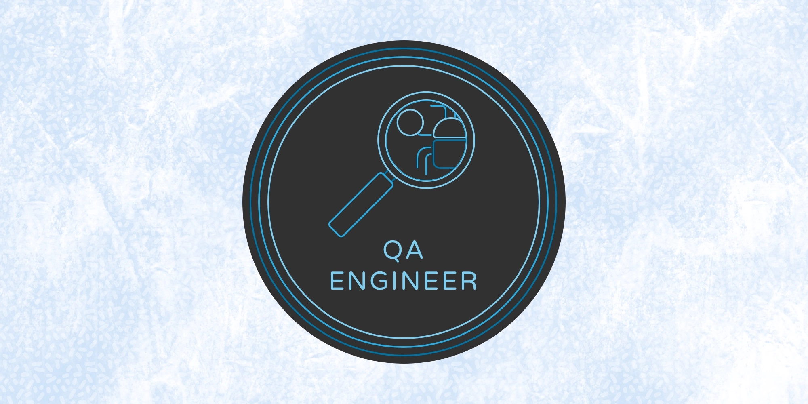

###🏻‍💻 &nbsp;About Me 

<h1 align="center">Привет! я Ильгиз и я QA</h1>

### Contacts

## :man_student: Дипломный проект [QA GURU](https://qa.guru/)

  
 &nbsp;

|      Project name               | GitHub links                                        
|-------------------------------- |-----------------------------------------------------|
|         UI tests                | https://github.com/igafarov90/amk_shop_ui_autotests |  
|        API tests                |                                                     |  
 

## Tech Stack
 

### ⚙️ &nbsp;GitHub Analytics

  